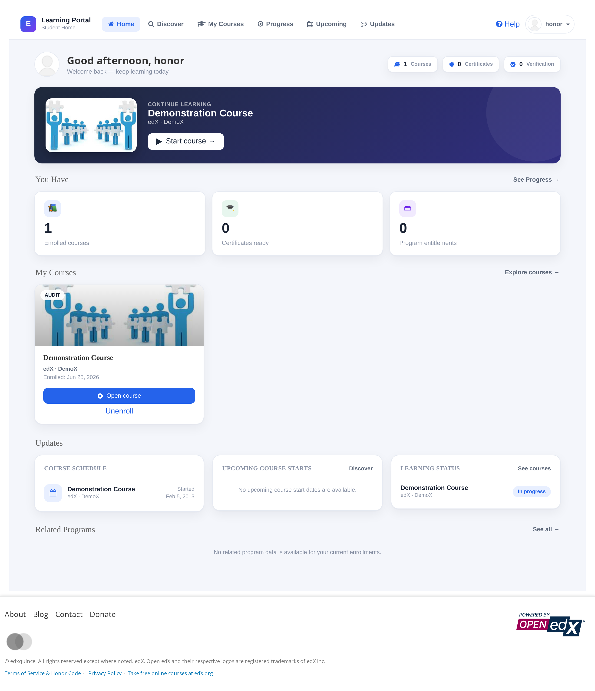
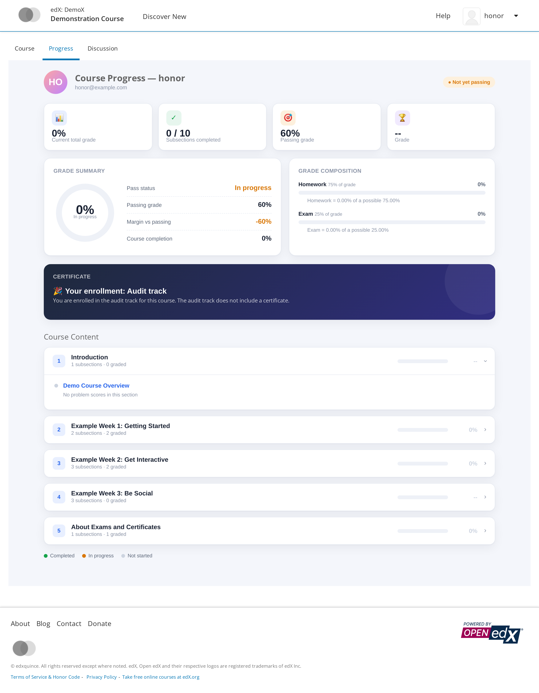
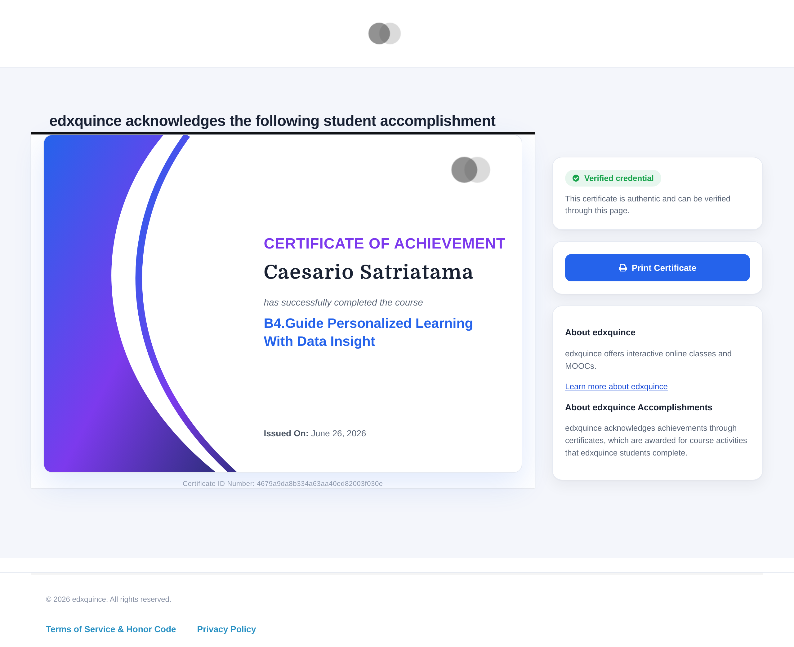
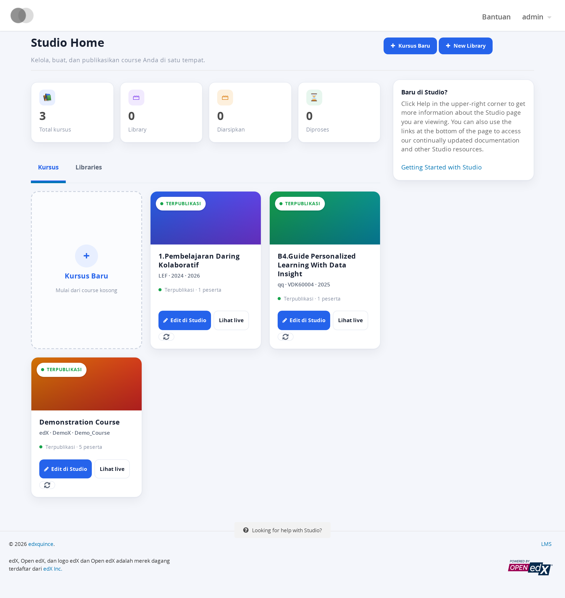

# edxquince — Kustomisasi Open edX (Quince)

Kumpulan kustomisasi untuk instalasi Open edX "edxquince". Semua perubahan tampilan
diletakkan pada **comprehensive theme** (`custom-theme`) sehingga **tidak mengubah file inti**
Open edX. Berisi juga terjemahan Bahasa Indonesia tambahan dan dokumentasi perubahan
konfigurasi/database yang bukan berupa file.

> ⚠️ File konfigurasi (`lms.yml`, `studio.yml`, dst.) **sengaja tidak disertakan** karena
> berisi rahasia (password DB, SECRET_KEY, token API). Lihat daftar *key* yang perlu diset di bawah.

## Struktur
```
theme/custom-theme/      Comprehensive theme (template Mako override)
  lms/templates/dashboard.html                         Dashboard galeri kartu (top-nav menggantikan sidebar, hero Continue learning, header global OpenedX disembunyikan + menu akun pindah ke nav, gambar kursus asli)
  lms/templates/courseware/progress.html               Halaman Progress redesign (ring nilai, Grade Composition per kategori, akordeon bab + skor problem, kartu sertifikat gradient)
  lms/templates/courseware/course_about.html           Halaman About gaya XuetangX
  lms/templates/certificates/valid.html                Halaman sertifikat (Accredible-style, palet biru–ungu selaras redesign)
  lms/templates/certificates/_accomplishment-rendering.html  Kartu sertifikat (gradient biru–ungu–indigo)
  cms/templates/index.html                             Studio Home → Portal Course Creator (galeri kartu, stat, badge publikasi + jumlah peserta nyata; React listing diganti Mako gallery)
  cms/templates/widgets/footer.html                    Studio: editor TinyMCE utk Course Overview + restyle halaman Certificates
  CERTIFICATE_README.md                                Catatan fitur sertifikat
locale/id/LC_MESSAGES/django.po(.mo)                   Terjemahan ID utk string custom (dashboard, progress, certificate, Portal Course Creator)
patches/courses.py.current-snippet.txt                 Catatan satu-satunya patch core (http:// link Studio)
```

> Halaman **Progress**, **Dashboard**, **Sertifikat**, dan **Portal Course Creator (Studio Home)**
> memakai satu bahasa desain yang konsisten (sistem kartu, palet biru–ungu, ring & progress bar,
> gradient `#1e293b→#312e81`). Semua logika fungsional (grades, sertifikat, enroll/unenroll,
> programs, schedule, create-course/library + JS, link Studio/LMS, modal) dipertahankan apa adanya;
> hanya lapisan tampilan yang di-redesign. Header global LMS hanya disembunyikan via CSS pada
> `.view-dashboard` (DOM tetap dirender oleh `main.html`). Di Studio Home, daftar React
> `CourseOrLibraryListing` diganti galeri Mako agar bisa menampilkan badge status & jumlah peserta.

## Tampilan

Render live (login sebagai `honor`, data nyata DemoX):

### Dashboard


### Progress


### Sertifikat


### Portal Course Creator (Studio Home)
Render `admin`, preferensi bahasa Indonesia (string ikut sistem terjemahan `_()` + `.po`):



## Cara deploy
1. Salin `theme/custom-theme/` ke `/edx/var/edxapp/themes/custom-theme/` (owner `edxapp`).
2. Salin `locale/id/...` ke `/edx/var/edxapp/locale/id/...` (owner `edxapp`).
3. Set konfigurasi (lihat di bawah), lalu restart `lms`/`cms`, bersihkan mako cache & memcached.

## Konfigurasi yang perlu diset (lms.yml & studio.yml) — TANPA nilai rahasia
- Theming:
  - `COMPREHENSIVE_THEME_DIRS: ['/edx/var/edxapp/themes']`
  - `DEFAULT_SITE_THEME: custom-theme`
  - `ENABLE_COMPREHENSIVE_THEMING: true`
- Terjemahan custom (set di **lms.yml DAN studio.yml** — Studio sebelumnya `[]`, perlu diisi agar string Portal Course Creator ikut diterjemahkan):
  - `PREPEND_LOCALE_PATHS: ['/edx/var/edxapp/locale']`
  - Setelah ubah `.po`: compile `.mo` (`msgfmt django.po -o django.mo`) lalu restart `lms`/`cms`.
- Sertifikat (FEATURES):
  - `CERTIFICATES_HTML_VIEW: true`
  - `ENABLE_CERTIFICATES_INSTRUCTOR_GENERATION: true`
- (Opsional) Analytics/Insights:
  - `ANALYTICS_DASHBOARD_URL: http://<lms-domain>:18110/courses`
- (Opsional) Warna brand via Site Configuration: `PRIMARY_COLOR`, `PRIMARY_COLOR_DARK`.

## Perubahan runtime/DB (bukan file — set lewat admin/management command)
- Waffle switch: `certificates.auto_certificate_generation` = **ON** (wajib agar tombol sertifikat muncul).
- `CertificateHtmlViewConfiguration` = enabled.
- Per-course `course-v1:qq+VDK60004+2025`:
  - Tambah `CourseMode` slug `audit` (agar enroll honor bisa auto-enroll).
  - `CertificateGenerationCourseSetting.self_generation_enabled = True`.
  - `certificates_display_behavior = early_no_info` ("Immediately upon passing").
  - Subsection quiz ditandai *graded* + grading policy disesuaikan (dilakukan di Studio).

## Catatan operasional
- Worker Celery LMS sempat hang karena AUTH Redis saat startup; pastikan `requirepass` Redis konsisten dengan `CELERY_BROKER_PASSWORD`.
- Setelah ubah grading/sertifikat: regenerasi block structure (`clear_course_from_cache`+`update_course_in_cache`) dan recompute grade bila perlu.
- nginx: vhost Insights `listen 18110` -> proxy `127.0.0.1:8110` (port harus dibuka di Azure NSG).

## Patch core (satu-satunya)
`lms/djangoapps/courseware/courses.py` — `get_cms_course_link`/`get_cms_block_link`
memakai `http://` (bukan `//`) agar link Studio benar. Lihat `patches/`.
